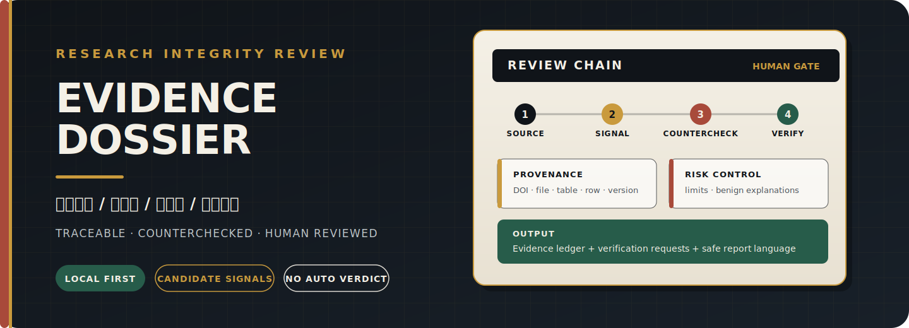

  

<h1 align="center">Research Integrity Evidence Review Agent</h1>

<strong>Evidence before conclusion. Traceable by design. Human reviewed.</strong>

证据先行 · 可追溯 · 可反证 · 人工复核

  <a href="https://github.com/simbazeng98/research-integrity-review-agent/actions/workflows/ci.yml">CI</a>
  · <a href="LICENSE">MIT License</a>
  · <a href="pyproject.toml">Python 3.10+</a>
  · Offline-first

## 30-Second Overview

This local-first toolkit turns DOI metadata, human-confirmed claims, source
tables, figures, and raw photovoltaic measurements into a reviewable package:

- a traceable **evidence ledger**;
- **candidate risk signals** with evidence locations;
- counter-evidence, alternative benign explanations, and limitations;
- **manual verification requests** and safe reader-facing reports.

It **does not determine research misconduct**, infer intent, or replace a
journal, institution, or qualified human reviewer. Social-media material is
treated as methodology or discovery context, never as a formal finding.

### Two ways to use it

| Route | Best for | Start here |
| --- | --- | --- |
| Local CLI | Reproducible package review with local files and structured outputs | [Install and run locally](#install-and-run-locally) |
| No-install agent workflow | Giving an AI agent a bounded method or a ready-made review task | [Use agent skills](skills/) · [Paste ready-to-use prompts](prompts/) · [No-install guide](docs/USING_WITHOUT_INSTALLATION.md) |

## What the Review Preserves

| Evidence | Context | Countercheck | Handoff |
| --- | --- | --- | --- |
| Source file, DOI, page, figure, table, or row | Rule ID, measurement context, and source version | Benign explanations, counter-evidence, and false-positive risks | Verification questions, limitations, and do-not-overclaim language |

The result is a structured review queue, not a verdict. High-priority signals
remain requests for source-data and methodological verification.

## Current Capabilities

### Cross-document and version review

- Human-confirmed atomic claims with explicit sample, device, measurement, and
  source-version context.
- Cross-document claim consistency checks across manuscript, supplement,
  source-data, and response versions.
- Version reconciliation that distinguishes open, partially explained, and
  formally corrected records.
- Publisher-level evidence is required before a record is treated as formally
  corrected; author responses alone remain explanatory context.

### Numeric and photovoltaic review

- Fixed-delta, terminal-digit, and **quantization-grid** candidate detection
  with precision, derived-column, ID-column, rounding, and unit-conversion
  controls.
- PCE consistency checks for multiscan data, non-1-sun intensity, rounding,
  and stabilized-versus-scan measurements.
- EQE/J-V, voltage-loss, stability, tandem, and raw-measurement reconciliation.
- **TRPL/TPV** unit and dual-exponential lifetime review with
  amplitude-weighted, intensity-weighted, and undeclared-formula handling.
- Curve-source coverage and opt-in **curve-segment similarity** review for
  human-confirmed, independently labelled CSV/XLSX columns; no image
  digitization is performed.
- **Materials process lineage** questions for sample-stage handling.

### Images, references, and reporting

- Image intake and same-package visual-similarity candidates.
- Source-table intake, citation/reference anomaly review, and DOI status
  enrichment.
- One **review-package** runner that produces a validated unified evidence
  index, reader report, and bilingual local dashboard.
- Correlation-aware Manual Review Priority Index (MRPI) grouping so repeated
  signals from the same source/table/method family are not simply stacked.
- A scope firewall: **engineering plausibility** questions are shown
  separately and contribute zero to integrity MRPI; unsupported motive claims
  are excluded from public findings.

Automatic PDF/LLM extraction cannot directly create a finding. Claims must be
confirmed by a human or supplied through an explicit structured intake.

## Install and Run Locally

~~~bash
# Install the package in this checkout
python -m pip install -e .

# Review the synthetic example package in Chinese
python -m integrity_agent review-package examples/toy_review_package --lang zh

# Validate the unified evidence ledger
python -m integrity_agent validate-ledger outputs/review_package/unified_evidence_index.jsonl

# Open the generated local HTML dashboard
python -m integrity_agent view outputs/review_package
~~~

Run the test suite with:

~~~bash
python -m pytest -q
~~~

The default workflows are offline. Network access is available only on commands
that expose an explicit **--allow-network** option. User papers and source data
are not uploaded by default.

For every command and output path, see the
[CLI reference](docs/CLI_REFERENCE.md) and
[review-package guide](docs/REVIEW_PACKAGE_RUNNER.md).

## Outputs

~~~text
Input
  DOI metadata / review package / source tables / figures / raw PV data

Review
  provenance + deterministic checks + counter-evidence + scope firewall

Output
  unified_evidence_index.jsonl
  review_package_summary.md
  review_package_dashboard.html
  module_status.jsonl
  review_package_manifest.json
~~~

Generated artifacts default to **outputs/**. Curated knowledge-base changes
require explicit paths or a curated workflow.

## Synthetic Examples and Benchmarks

All committed examples are synthetic. They verify workflow contracts and
regression behavior; they are not claims about real-world detection accuracy.

- [Toy examples](examples/)
- [Benchmark methodology](docs/BENCHMARKS.md)
- [Archived v0.1.0 synthetic snapshot](benchmarks/results/v0.1.0_toy_benchmarks.yml)

Use a fresh local run for current output counts rather than treating an
archived snapshot as a live product metric.

## Method Inspiration and Credits

We gratefully credit public research-review method discussions by:

- Xiaohongshu creator **「钙钛矿纠察队长」**;
- Bilibili creator **「耿同学讲故事」**.

These public discussions are **method and discovery leads only**. Every
candidate finding produced from a reused method still requires **independent verification**
against the paper, supplied source data, and authoritative version or publisher
evidence.

This repository is an **independent open-source implementation** with **no affiliation or endorsement**
by either creator or platform. Credit does not confirm any post-, video-,
person-, or case-level claim.

The repository does not republish account identifiers, avatars, screenshots,
post text, complete comments, complete transcripts, private messages, or
private research material. Public traceability is limited to short structured
summaries and curated source links:

- [Perovskite public method cards](knowledge_base/cases/perovskite_public_methods/)
- [Geng video method cards](knowledge_base/cases/geng_video_cases/)

## Safety Boundary

- Prefer “candidate risk signal”, “needs manual review”, and “verification
  request”.
- Preserve alternative benign explanations, missing evidence, and limitations.
- Keep engineering feasibility separate from research-integrity scoring.
- Do not infer author intent, responsibility, or motive from a detector output.
- Treat social posts, videos, comments, and blogs as discovery context, not
  formal status evidence.
- Do not commit real PDFs, full supplementary packages, complete social
  content, credentials, or private paths.

Read the full [ethics and scope](docs/ETHICS_AND_SCOPE.md),
[reporting language](docs/REPORTING_LANGUAGE.md), and
[repository hygiene](docs/REPOSITORY_HYGIENE.md) contracts before applying the
tool to real material.

## Project Layout

~~~text
.github/workflows/    CI and offline CLI smoke checks
benchmarks/           synthetic benchmark snapshots
docs/                 ethics, architecture, usage, and reporting guidance
examples/             toy-only review packages
integrity_agent/      CLI, schemas, workflows, detectors, and domain plugins
knowledge_base/       public case cards, policies, and detector specifications
prompts/              ready-to-paste review prompts
skills/               portable agent skills
tests/                regression and safety contracts
~~~

## Policy Anchors and Prior Art

The project uses public research-integrity and publication-correction policies
as cautious reporting anchors. See
[the example policy record](knowledge_base/policies/example_policy.yml).

It may learn from public tools and workflows such as
**academic-integrity-skill**, **Anti-Autoresearch**,
**PubPeer Zotero plugin**, and **imagededup**, but it is not a fork of those
projects. Its distinguishing contract is case-driven review, traceable
evidence, explicit counterchecks, and safe reporting language.
