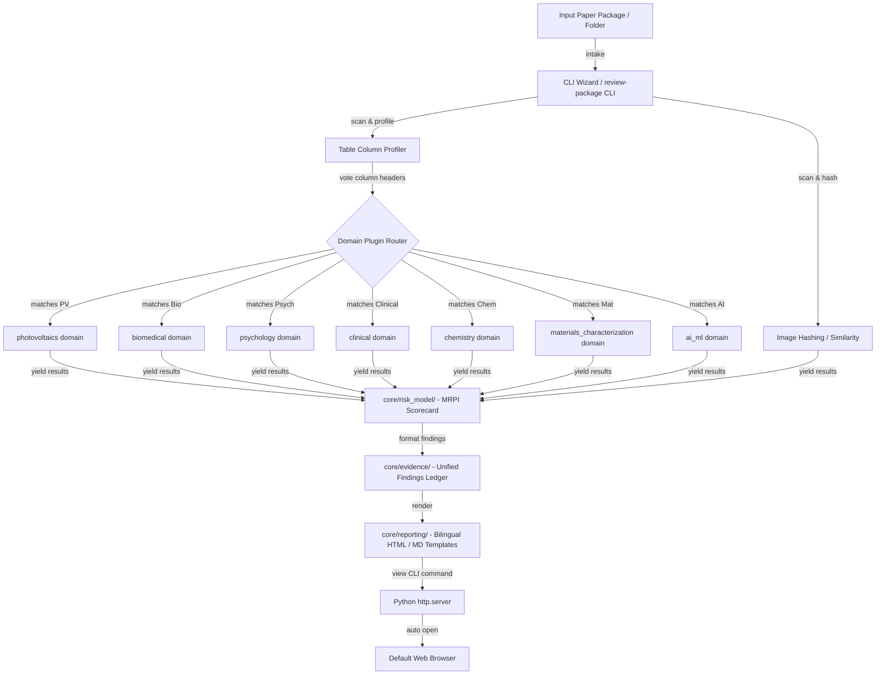

# Design Spec: Research Integrity Review Agent - Architecture & Usability Optimization

This document outlines the design specification for upgrading the Research Integrity Evidence Review Agent to version 0.2.0. It details the system architecture, unified evidence schemas, bilingual (i18n) framework, multi-discipline domain plugin skeletons, and the zero-dependency local Web Dashboard.

---

## 1. Objectives & Requirements

### 1.1 All-Discipline Support
- Provide standardized skeletons (`MetricRow` schemas, regex-based field mapping, unit normalizers) for all 6 empty domains (`ai_ml`, `biomedical`, `chemistry`, `clinical`, `materials_characterization`, `psychology_social_science`), modeled after the existing mature `photovoltaics` domain.
- Implement an adaptive table-header voting system that dynamically routes data to the correct domain plugin.

### 1.2 Bilingual Friendliness (中英文双语友好)
- **Reports & Outputs**: Generate HTML/Markdown reports with translation dictionaries and dual-language switching in the browser.
- **CLI Commands & Interaction**: Add a bilingual interactive onboarding wizard (`integrity-agent wizard`) to guide users in Chinese and English.
- **Rules & Definitions**: Support bilingual structures for rule titles, descriptions, safe language findings, alternative explanations, and verification checklists.

### 1.3 Easy to Use (Simple & Portable)
- No Node.js/npm dependencies for end users. The local web dashboard must run as a single portable HTML page.
- Implement a zero-dependency web server utilizing Python's built-in `http.server` and `webbrowser` modules to automatically run and view results with one CLI flag: `--view`.
- Single command installation via `pip install .` or `pip install -e .`.

### 1.4 Rigor & Scorecard
- Introduce a **Manual Review Priority Index (MRPI)** in `core/risk_model/` to estimate risk density as a normalized percentage (0% to 100%).
- Unify the image detection findings (`ImageEvidenceFinding`) into the core `Finding` schema in `core/evidence/`.
- Refactor the misplaced report generators from `workflows/` to `core/reporting/`.

---

## 2. System Architecture



---

## 3. Data Model Modifications (Schemas)

### 3.1 Unified Findings (`core/evidence/schema.py`)
Unify `ImageEvidenceFinding` and table findings into the core `Finding` class. Ensure it uses `@dataclass(frozen=True)` for immutability.

```python
# core/evidence/schema.py
from dataclasses import dataclass, field
from enum import Enum
from typing import Dict, List, Any, Union

class RiskLevel(str, Enum):
    LOW = "low"
    MEDIUM = "medium"
    HIGH = "high"

@dataclass(frozen=True)
class EvidenceItem:
    source: str
    location: str
    quote: str | None = None
    page: int | None = None
    figure: str | None = None
    table: str | None = None
    row: int | None = None
    metadata: Dict[str, Any] = field(default_factory=dict)

    def to_record(self) -> Dict[str, Any]:
        # serialization logic
        pass

@dataclass(frozen=True)
class ManualVerification:
    needed: bool
    requests: List[Dict[str, str]]  # Dual language keys: {"en": "...", "zh": "..."}

@dataclass(frozen=True)
class Finding:
    finding_id: str
    finding_category: str  # "image", "table", "domain_pv", "domain_psych", etc.
    type: str
    title: Dict[str, str]  # Dual language keys: {"en": "...", "zh": "..."}
    risk: RiskLevel
    summary: Dict[str, str]  # Dual language keys
    evidence: List[EvidenceItem]
    manual_verification: ManualVerification
    false_positive_risks: List[Dict[str, str]] = field(default_factory=list)
    alternative_explanations: List[Dict[str, str]] = field(default_factory=list)
    limitations: Dict[str, str] = field(default_factory=dict)
    provenance: Dict[str, Any] = field(default_factory=dict)

    def to_ledger_record(self) -> Dict[str, Any]:
        # returns JSONL-serializable dictionary
        pass
```

### 3.2 Dynamic Language Resolution helper
Extend `Finding` or add a helper to resolve text dynamically based on selected locale:
```python
def resolve_bilingual_string(data: Union[str, Dict[str, str]], locale: str = "en") -> str:
    if isinstance(data, str):
        return data
    return data.get(locale, data.get("en", ""))
```

---

## 4. Bilingual & Translation Manager (`core/i18n/`)

Create a bilingual translation system that works offline.

### 4.1 Directory Structure
```text
integrity_agent/core/i18n/
├── __init__.py
├── manager.py
└── locales/
    ├── en.yml
    └── zh.yml
```

### 4.2 Translation Manager (`manager.py`)
```python
import os
import yaml
from typing import Dict, Any

class I18nManager:
    _instance = None

    def __new__(cls):
        if not cls._instance:
            cls._instance = super(I18nManager, cls).__new__(cls)
            cls._instance._current_locale = os.environ.get("INTEGRITY_LOCALE", "en")
            cls._instance._translations = cls._instance._load_locales()
        return cls._instance

    def set_locale(self, locale: str):
        if locale in ["en", "zh"]:
            self._current_locale = locale

    def get_locale(self) -> str:
        return self._current_locale

    def translate(self, key: str, default: str = None) -> str:
        keys = key.split(".")
        val = self._translations.get(self._current_locale, {})
        for k in keys:
            if isinstance(val, dict):
                val = val.get(k, None)
            else:
                return default or key
        return val or default or key

    def _load_locales(self) -> Dict[str, Any]:
        translations = {}
        locales_dir = os.path.join(os.path.dirname(__file__), "locales")
        for locale in ["en", "zh"]:
            path = os.path.join(locales_dir, f"{locale}.yml")
            if os.path.exists(path):
                with open(path, "r", encoding="utf-8") as f:
                    translations[locale] = yaml.safe_load(f)
            else:
                translations[locale] = {}
        return translations

_i18n = I18nManager()
def _(key: str, default: str = None) -> str:
    return _i18n.translate(key, default)
```

---

## 5. Domain Plugin Skeletons (`domains/`)

Establish the generic plugin contract in `integrity_agent/domains/base.py`:

```python
# domains/base.py
from abc import ABC, abstractmethod
from typing import List, Any, Dict
from integrity_agent.core.tables.table_schema import TableData
from integrity_agent.core.evidence.schema import Finding, FieldMapping

class BaseDomainPlugin(ABC):
    @abstractmethod
    def get_domain_id(self) -> str:
        """Returns unique domain id (e.g. 'biomedical', 'clinical')"""
        pass

    @abstractmethod
    def get_field_mappings(self) -> Dict[str, List[str]]:
        """Maps canonical names to lists of regex patterns"""
        pass

    @abstractmethod
    def normalize_units(self, field_name: str, value: float, raw_unit: str) -> tuple[float, List[str]]:
        """Standardizes values to default units, returning warning list if any."""
        pass

    @abstractmethod
    def build_metric_rows(self, raw_tables: List[TableData]) -> List[Any]:
        """Parses generic tables into the domain's specific MetricRow instances"""
        pass

    @abstractmethod
    def run_detectors(self, rows: List[Any], options: Dict[str, Any] = None) -> List[Finding]:
        """Runs all rules in this domain, producing unified Findings"""
        pass
```

### 5.1 The 6 Target Skeletons
We define stub-classes in each domain (`schema.py` and `__init__.py`):
1. **`biomedical`**: `BiomedicalMetricRow` (fields: `gene_symbol`, `expression_level`, `band_intensity`, `p_val`, `sample_id`). Detectors check: qPCR fold change thresholds, Western blot band intensity overlaps.
2. **`psychology_social_science`**: `PsychologyMetricRow` (fields: `mean`, `std_dev`, `t_value`, `f_value`, `df`, `sample_size`). Detectors check: GRIM/SPRITE mathematical consistency tests on reported stats.
3. **`clinical`**: `ClinicalTrialMetricRow` (fields: `trial_id`, `arm_name`, `group_size`, `age_mean`, `age_sd`, `p_val`). Detectors check: Carlisle-Ramsay random baseline demographic distribution.
4. **`chemistry`**: `ChemistrySpectrumMetricRow` (fields: `peak_shift`, `multiplicity`, `coupling_constant`, `element_percentage`). Detectors check: elemental analysis calculation verification.
5. **`materials_characterization`**: `MaterialsCharMetricRow` (fields: `characterization_method`, `instrument_model`, `voltage`, `pressure`). Detectors check: completeness check for XRD, XPS, SEM parameters.
6. **`ai_ml`**: `AIMLBenchmarkRow` (fields: `model_name`, `dataset_name`, `metric`, `reported_score`). Detectors check: cross-table model benchmark consistency.

---

## 6. Manual Review Priority Index (MRPI) Scorecard

The risk scoring algorithm calculates review priority to represent the concentration of anomalies.

### 6.1 Weighting Strategy
- **High-Risk Finding**: 0.35 weight (e.g. SHA256 match, PCE deviation >20%)
- **Medium-Risk Finding**: 0.15 weight (e.g. pHash similarity, Voc loss violation)
- **Low-Risk Finding**: 0.05 weight (e.g. Missing metadata columns)

### 6.2 Formula (`core/risk_model/risk_calculator.py`)
```python
def calculate_mrpi(findings: List[Finding]) -> float:
    total_score = 0.0
    for f in findings:
        weight = 0.05
        if f.risk == RiskLevel.HIGH:
            weight = 0.35
        elif f.risk == RiskLevel.MEDIUM:
            weight = 0.15

        # Apply detector confidence mapping if present in provenance metadata
        confidence = f.provenance.get("confidence", 1.0)
        total_score += weight * confidence

    return min(1.0, total_score)
```

---

## 7. Local Web Dashboard & Zero-Dependency Server

### 7.1 Single File HTML Template (`core/reporting/templates/dashboard.html`)
The dashboard is a self-contained HTML page containing CSS and vanilla JS inside `<style>` and `<script>` tags. It is implemented as a zero-dependency vanilla JS dashboard without external charting libraries like ECharts to reduce footprint and dependency maintenance overhead.

### 7.2 Zero-Dependency Python Server CLI
Add `view` command and `--view` option inside `__main__.py` to spin up a local server and launch the browser:

```python
# integrity_agent/workflows/report_viewer.py
import http.server
import socketserver
import webbrowser
import threading
from pathlib import Path

class QuietHTTPRequestHandler(http.server.SimpleHTTPRequestHandler):
    def log_message(self, format, *args):
        pass  # Suppress console log spam

def start_server_and_open_browser(directory_path: Path, port: int = 8080):
    handler = lambda *args, **kwargs: QuietHTTPRequestHandler(*args, directory=str(directory_path), **kwargs)

    # Try finding an open port if port is taken
    while True:
        try:
            server = socketserver.TCPServer(("", port), handler)
            break
        except OSError:
            port += 1

    url = f"http://localhost:{port}/review_report.html"
    print(f"[i18n: Serving report at] {url}")

    # Run server in background thread and open browser
    threading.Thread(target=server.serve_forever, daemon=True).start()
    webbrowser.open(url)
```

---

## 8. CLI Command Specification

### 8.1 Onboarding Wizard (`integrity-agent wizard`)
An interactive CLI loop that walks non-technical users through analyzing a paper package:
1. Select language (ZH / EN).
2. Input directory containing paper materials.
3. Automatically list found files and run the appropriate detector workflows.
4. Auto-launch the Web Dashboard.

### 8.2 Viewer Command (`integrity-agent view <output_dir>`)
Serves and displays the generated reports of a previous run.

---

## 9. Verification & Testing Checklist

- [ ] Check if `scan_for_forbidden_phrases` passes successfully on new code.
- [ ] Verify that `--lang zh` correctly translates the Wizard interactive prompts and runtime outputs.
- [ ] Confirm Web Dashboard functions correctly offline (disconnect WiFi, open report).
- [ ] Run benchmark validation: `pytest` must continue to pass all toy suites without regression.
- [ ] Confirm no external dependencies (like node_modules) are created during installation.
